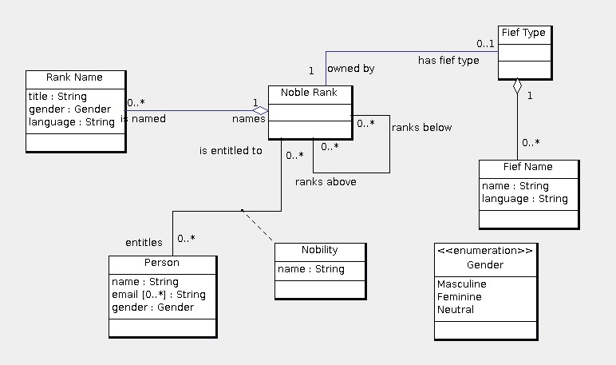

Assignment link: http://www.ccs.neu.edu/home/kenb/16/fal/5200/2.html

Express the following as queries or commands using SQL. The queries and commands must function correctly for a database state of the SQL schema as specified by *createTables.sql* (i.e., any state of the database that satisfies all of the constraints specified in the SQL schema). The UML diagram above might help you to formulate your queries and commands, but your queries and commands must be for the SQL schema.

1. List both the personal name and the noble name (i.e., the person's nobility name) of every "Count" (in any language) in the database.
2. For a person (given their id), list every nobility to which they are entitled. For each nobility, show the rank in German and noble name. If a rank has several German names, show all of them. The names must have compatible genders.
3. Show every noble rank and the fief (by Italian name) that it has. If a noble rank has no fief, then show the rank as "landless". If the fief has no Italian name, then show the rank as "unnamed fief".
4. Given an email address, determine whether there is a noble person with that email address.
5. List all ranks of nobility for which there is someone who has that rank. For each rank show its id and name(s) in English. If a rank has no name in English, then just show its id.
6. Find all pairs consisting of a personal name and noble name (i.e., the person's nobility name) such that every duke of that noble name (i.e., the person's nobility name) entitles a person with the personal name.
7. List the ranks of nobility that are above the rank of "Comte" (French for "Count"). For each rank show its name(s) in French.
8. List the ranks of nobility that are both above and below themselves. For each rank show its name(s) in English.
9. For a person (given their id) show the highest rank (or ranks) of nobility to which the person is entitled.
10. Show how to add a new name in a language for a rank of nobility (given its id) so that the new name is the only name in that language for that rank of nobility. The new name will have Neutral gender.
11. Show how to endow (i.e., entitle) an existing person (given their id) with a new rank of nobility. The new rank must be above (and not equal to) every rank of nobility that the person currently has. You may use more than one query and/or command.
12. Show how to disentitle a person (given their id) from all their noble ranks.
13. Update all Hungarian rank names to have Neutral gender.

> The solution is in queryTables.sql
