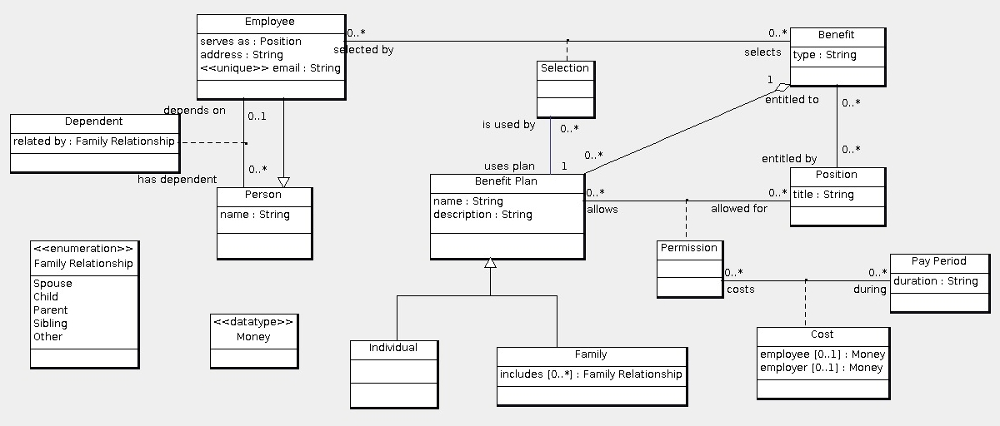

Assignment link: http://www.ccs.neu.edu/home/kenb/16/fal/5200/3.html

   
Use the relational model to the above data model for solving the following:
1. Develop an assertion, written in SQL, that enforces the requirement that allows a benefit plan must be entitled to the benefit that the benefit plan is a part of.
2. Develop an assertion, written in SQL, that enforces the requirement that an employee who selects a benefit plan must have a position that is entitled to the benefit and allows this benefit plan.
3. Develop an assertion, written in SQL, that enforces the requirement that every family benefit plan selected by an employee include the family relationships of all dependents of the employee.
4. Give the user 'HRAgent' the ability to modify the cost of a benefit plan (by name and description) allowed for a position (by title) during a pay period (by duration). Modification includes adding and deleting as well as updating cost records.
5. The following are the main commands being performed on this database:
  i. Insert a new employee given the person details and the benefits selected
  ii. Find the benefit plan information given the position
  iii. List all the benefit plans along with the benefit type and order by the plan name
  iv. Compute the average pay duration for each positions
  v. List the benefit plans for people whose names begin with some letter
List the candidate indexes for collection of queries and commands. Note that the solution is a single collection of candidate indexes for all queries and commands, not a collection for each query and command.

> Solution in assignment3.sql uses the schema in createTables.sql
