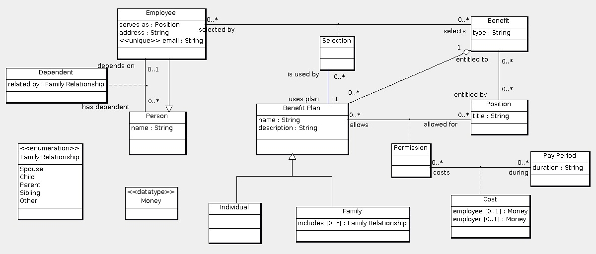

Assignment link: http://www.ccs.neu.edu/home/kenb/16/fal/5200/4.html

   
Use the relational model to the above data model for solving the following:  
1. Develop an Employee Java class. This class has the attributes of Employee, the dependents of the employee, including how they are related to the employee, the benefits selected by the employee, the benefit plan for each selected benefit, and the costs for each pay period that is allowed for the employee's position. See Question #2 of Assignment #5 for the kinds of data that must be represented in your Java class.  
2. Develop a constructor for your Employee Java class that has two parameters: the employee id and a connection to the database. Use JDBC to construct the Employee object for the employee with the specified id.  
3. Develop a method that changes a benefit plan for an employee. The method has two parameters: the type of benefit and the name of the benefit plan. You may assume that these two parameters uniquely determine a benefit plan. You have to check that the employee currently has a benefit plan for the benefit and that the new benefit plan is allowed for the employee's position. Use JDBC to update the database.  
4. Develop a method that computes the annual cost to the employee of every benefit plan for a specified benefit. The method has two parameters: the benefit id and pay period duration. Only consider three durations: week, month and quarter. Return a map that maps each duration to an annual cost.  
